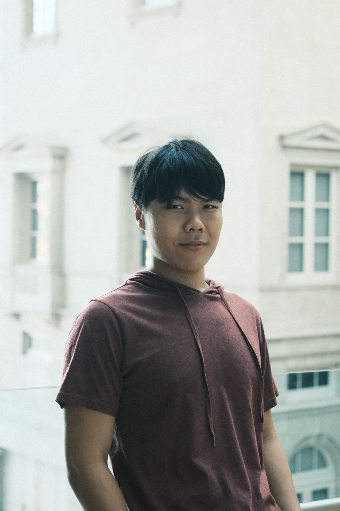

# About Us

We are a team based in the [School of Computing, National University of Singapore](http://www.comp.nus.edu.sg).

You can reach us at the email `seer[at]comp.nus.edu.sg`

## Project team

### Lau Heng Yi

[[github](https://github.com/lauhengyi)]
[[portfolio](team/johndoe.md)]

- Role: Team Lead
- Responsibilities: Logic

### Ernest Lim

[[github](http://github.com/ernestlsy)]
[[portfolio](team/johndoe.md)]

- Role: Documentation
- Responsibilities: Model

### Ong Li Hong

[[github](https://github.com/wswddl)] [[portfolio](team/johndoe.md)]

- Role: Deliverables
- Responsibilities: Ui

### Yu Qian

[[github](http://github.com/yuqiannemo)]
[[portfolio](team/johndoe.md)]

- Role: Code Quality
- Responsibilities: Data

### Gabriella

[[github](http://github.com/GabriellaGloria)]
[[portfolio](team/johndoe.md)]

* Role: Testing
* Responsibilities: Storage

