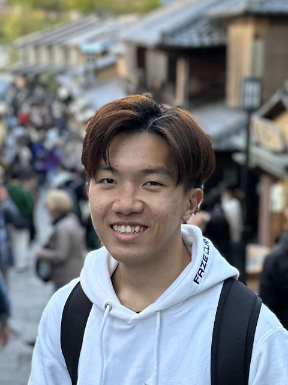
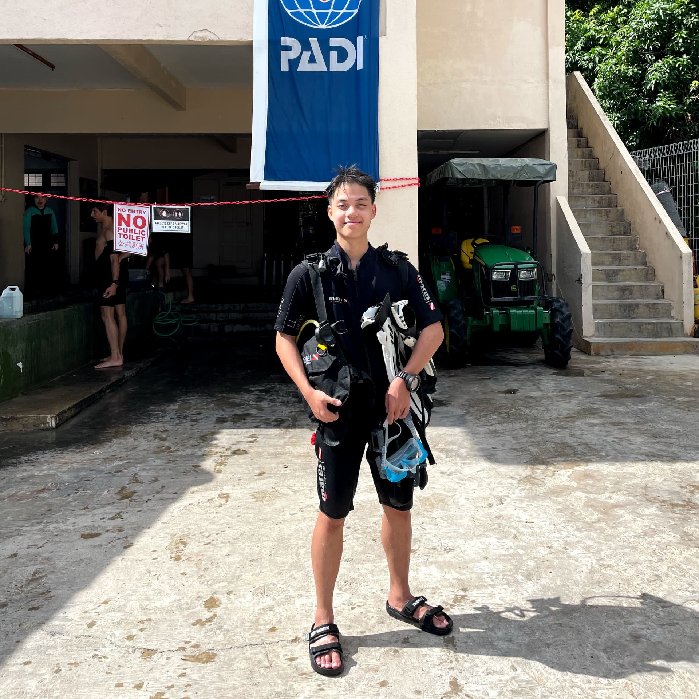
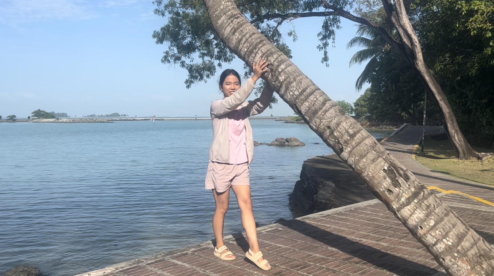

# About Us

We are a team based in the [School of Computing, National University of Singapore](http://www.comp.nus.edu.sg).

You can reach us at the email `seer[at]comp.nus.edu.sg`

## Project team

### John Doe

[[homepage](http://www.comp.nus.edu.sg/~damithch)]
[[github](https://github.com/johndoe)]
[[portfolio](team/johndoe.md)]

* Role: Project Advisor

### Ernest Lim

[[github](http://github.com/ernestlsy)]
[[portfolio](team/johndoe.md)]

* Role: Documentation
* Responsibilities: Model

### Ong Li Hong

[[github](https://github.com/wswddl)] [[portfolio](team/johndoe.md)]

* Role: Deliverables
* Responsibilities: UI

### Yu Qian

[[github](http://github.com/yuqiannemo)]
[[portfolio](team/johndoe.md)]

* Role: Code Quality
* Responsibilities: Model

### James Doe

[[github](http://github.com/johndoe)]
[[portfolio](team/johndoe.md)]

* Role: Developer
* Responsibilities: UI
