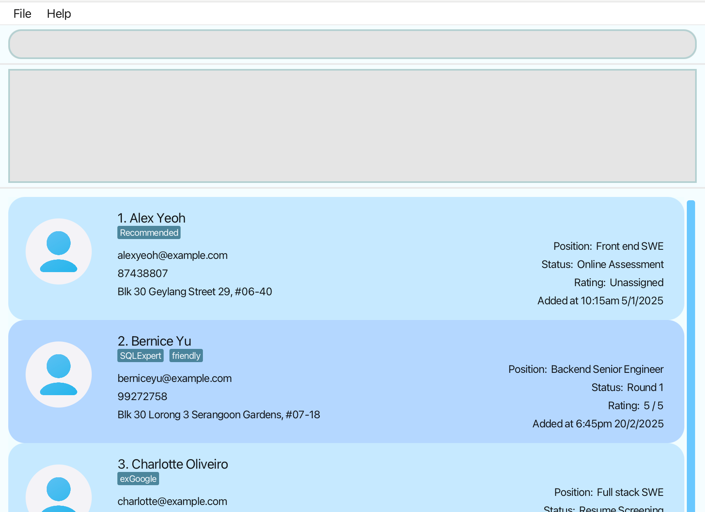
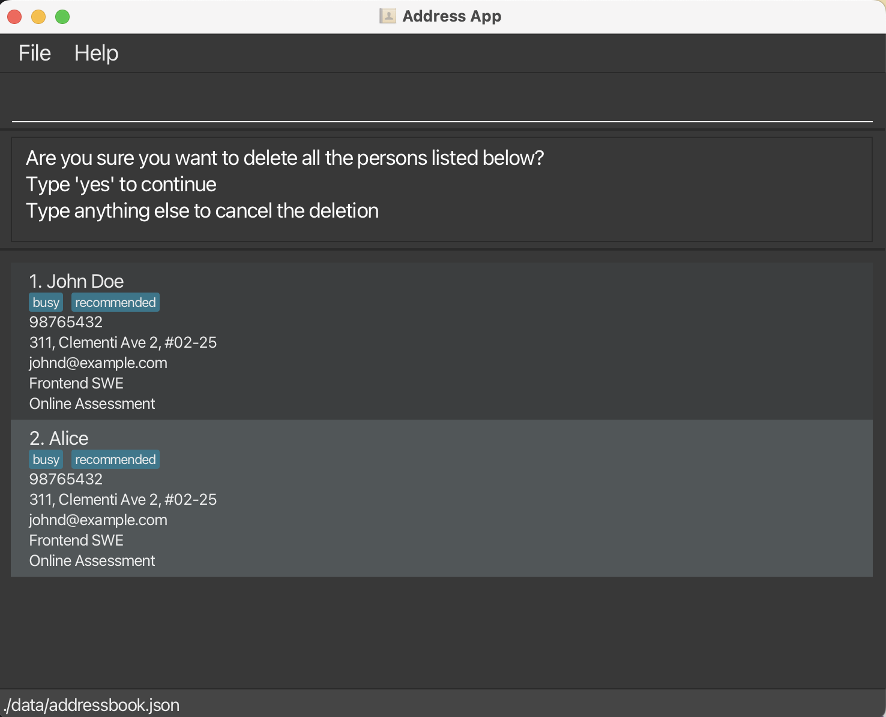
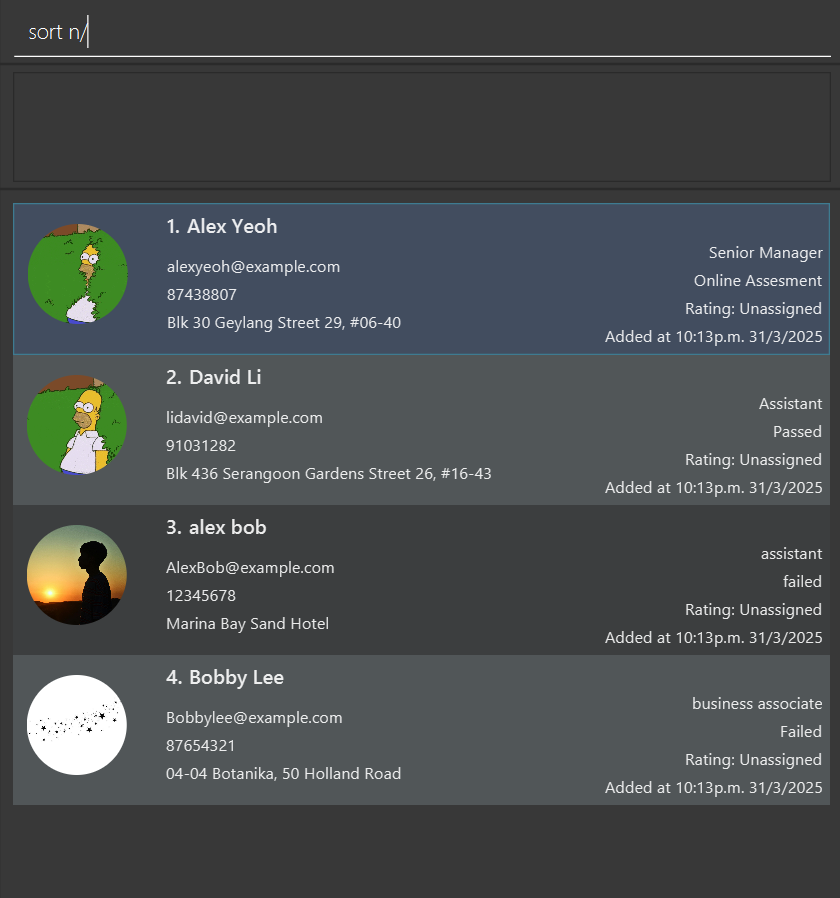
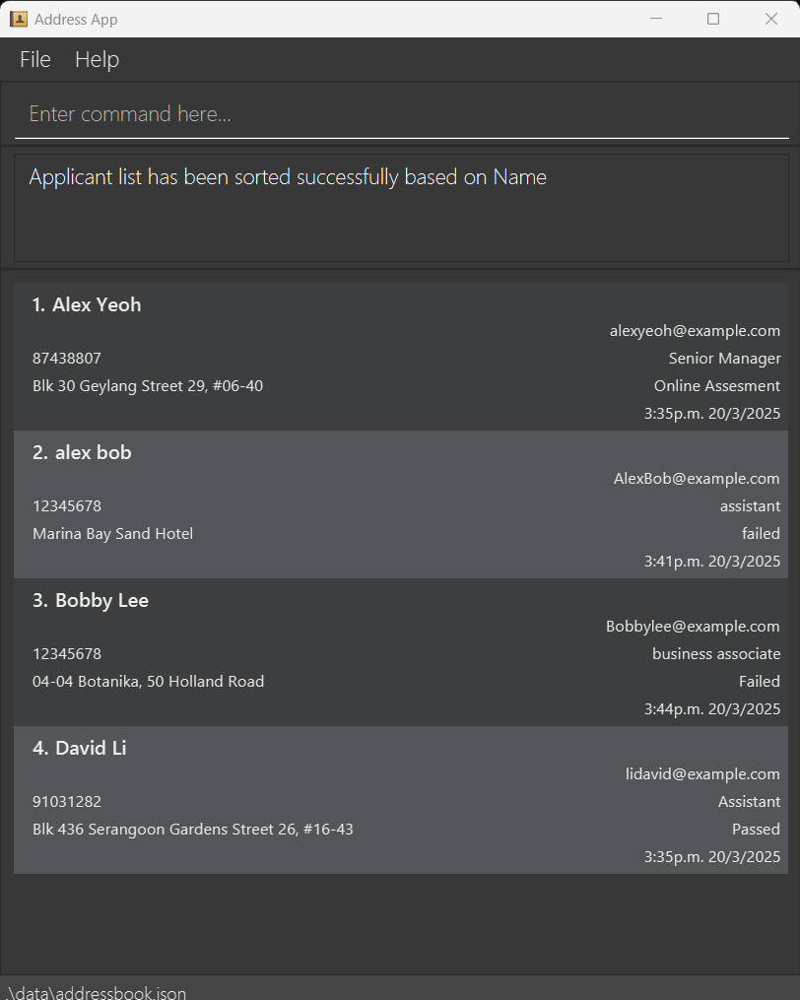

# RecruitTrack User Guide

RecruitTrack is a **desktop app for managing contacts, optimized for use via a  Line Interface** (CLI) while still having the benefits of a Graphical User Interface (GUI). If you can type fast, AB3 can get your contact management tasks done faster than traditional GUI apps.

<!-- * Table of Contents -->
<page-nav-print />

--------------------------------------------------------------------------------------------------------------------

## Quick start

1. Ensure you have Java `17` or above installed in your Computer. 
   **Mac users:** Ensure you have the precise JDK version prescribed [here](https://se-education.org/guides/tutorials/javaInstallationMac.html).

1. Download the latest `.jar` file from [here](https://github.com/se-edu/addressbook-level3/releases).

1. Copy the file to the folder you want to use as the _home folder_ for your AddressBook.

1. Open a command terminal, `cd` into the folder you put the jar file in, and use the `java -jar addressbook.jar` command to run the application. 
   A GUI similar to the below should appear in a few seconds. Note how the app contains some sample data. 
   

1. Type the command in the command box and press Enter to execute it. e.g. typing **`help`** and pressing Enter will open the help window. 
   Some example commands you can try:

   * `list` : Lists all applicants.

   * `add n/John Doe p/98765432 e/johnd@example.com j/Front-end Engineer s/Online Assessment a/John street, block 123, #01-01` : Adds a applicant named `John Doe` to the Applicant Records.

   * `delete id/3` : Deletes the 3rd applicant shown in the current list.

   * `clear` : Deletes all applicants.

   * `exit` : Exits the app.

1. Refer to the [Features](#features) below for details of each command.

--------------------------------------------------------------------------------------------------------------------

## Features

<box type="info" seamless>

**Notes about the command format:** 

* Words in `UPPER_CASE` are the parameters to be supplied by the user. 
  e.g. in `add n/NAME`, `NAME` is a parameter which can be used as `add n/John Doe`.

* Items in square brackets are optional. 
  e.g. `n/NAME [t/TAG]` can be used as `n/John Doe t/friend` or as `n/John Doe`.

* Items with `…`​ after them can be used multiple times including zero times. 
  e.g. `[t/TAG]…​` can be used as ` ` (i.e. 0 times), `t/friend`, `t/friend t/family` etc.

* Parameters can be in any order. 
  e.g. if the command specifies `n/NAME p/PHONE_NUMBER`, `p/PHONE_NUMBER n/NAME` is also acceptable.

* Extraneous parameters for commands that do not take in parameters (such as `help`, `list`, `exit` and `clear`) will be ignored. 
  e.g. if the command specifies `help 123`, it will be interpreted as `help`.

* If you are using a PDF version of this document, be careful when copying and pasting commands that span multiple lines as space characters surrounding line-breaks may be omitted when copied over to the application.
</box>

### Viewing help : `help`

Shows a message explaining how to access the help page.

Format: `help`

### Adding an applicant: `add`

Adds an applicant to the applicant records.

Format: `add n/NAME p/PHONE_NUMBER e/EMAIL j/JOB_POSITION s/STATUS a/ADDRESS [t/TAG]…​`

<box type="tip" seamless>

**Tip:** A applicant can have any number of tags (including 0)
</box>

Examples:
* `add n/John Doe p/98765432 e/johnd@example.com j/Frontend Engineer s/Online Assessment a/John street, block 123, #01-01`
* `add n/Betsy Crowe t/friend e/betsycrowe@example.com j/Backend Intern s/Offered a/Raffles Hall p/1234567 t/criminal`

### Listing all applicants : `list`

Shows a list of all applicants in the applicant records.

Format: `list`

### Editing an applicant : `edit`

Edits an existing applicant in the Applicant Records.

Format: `edit INDEX [n/NAME] [p/PHONE] [e/EMAIL] [a/ADDRESS] [t/TAG]…​`

* Edits the applicant at the specified `INDEX`. The index refers to the index number shown in the displayed applicant list. The index **must be a positive integer** 1, 2, 3, …​
* At least one of the optional fields must be provided.
* Existing values will be updated to the input values.
* When editing tags, the existing tags of the applicant will be removed i.e. adding of tags is not cumulative.
* You can remove all the applicant’s tags by typing `t/` without
    specifying any tags after it.

Examples:
*  `edit 1 p/91234567 e/johndoe@example.com` Edits the phone number and email address of the 1st applicant to be `91234567` and `johndoe@example.com` respectively.
*  `edit 2 n/Betsy Crower t/` Edits the name of the 2nd applicant to be `Betsy Crower` and clears all existing tags.

### Exporting applicant data: `export`

Allow users to export the candidate data into a CSV file

Format: `export [FILE-NAME]`

* Filename is the name of the CSV file to be generated
* The exported data includes all applicants in the list. Each row represents one 
  applicant and includes fields such as : name, email, phone number,
  job position, status, and tags.

Examples:
* `export applicants_data.csv` Export the current applicant data into a file named applicants_data.csv and download for the user.

### Locating applicants by name: `search`

Searches applicants whose names contain any of the given keywords.

Format: `search [n/NAME] [e/EMAIL] [j/JOB_POSITION] [s/STATUS]`

* The search is case-insensitive. e.g. `hans` will match `Hans`
* Only full words will be matched e.g. `Han` will not match `Hans`
* Only applicants that match all provided criteria are returned (i.e. `AND` search). 
  e.g. `search n/John e/john@example.com` searches by name and email

Examples:
* `search e/john@example.com` returns `John Doe (john@example.com)`
* `search j/Software Engineer` returns `Alex Yeoh (Software Engineer)` 

### Deleting an applicant : `delete`

Deletes the specified applicant from the applicant records, including all associated application details.

Format: `delete IDENTIFIER_TYPE/CONTACT_IDENTIFIER [--force]`

* Deletes the applicant based on the specified `IDENTIFIER_TYPE` and `CONTACT_IDENTIFIER`.
* The `IDENTIFIER_TYPE` can be one of the following:
    * `n/` – Name
    * `e/` – Email
    * `p/` – Phone number
    * `id/` – The ID in the last shown list
* The `CONTACT_IDENTIFIER` must match the corresponding identifier type (e.g., a name for `n/`, an email for `e/`, etc.).
* The `--force` flag (optional) bypasses confirmation prompts and deletes the applicant immediately.

Examples:
* `delete n/John Doe` deletes the applicant with the name "John Doe".
* `delete e/johndoe@example.com` deletes the applicant with the email "johndoe@example.com".
* `delete id/3 --force` deletes the 3rd applicant in the last shown list without confirmation.
* `delete p/12345678` deletes the applicant with the phone number "+6512345678".
  
  

### Updating the application status of an applicant : `update`

Updates the status of the specified applicant from the applicant records.

Format: `update IDENTIFIER_TYPE/CONTACT_IDENTIFIER s/STATUS`

* Identifies the applicant based on the specified `IDENTIFIER_TYPE` and `CONTACT_IDENTIFIER`, then updates their application status to the provided `STATUS`.
* The `IDENTIFIER_TYPE` can be one of the following:
    * `n/` – Name
    * `e/` – Email
    * `p/` – Phone number
    * `id/` – The index of the applicant in the last shown list
* The `CONTACT_IDENTIFIER` must match the corresponding identifier type (e.g., a name for `n/`, an email for `e/`, etc.).
* The `STATUS` should contain only alphanumeric characters and spaces.

Examples:
* `update n/John Doe s/Interview Scheduled` updates the status of the applicant with the name "John Doe" to "Interview Scheduled".
* `update e/johndoe@example.com s/Pending Review` updates the status of the applicant with the email "johndoe@example.com" to "Pending Review".
* `update id/3 s/Offer Accepted` updates the status of the 3rd applicant in the last shown list to "Offer Accepted".
* `update p/12345678 s/Failed` updates the status of the applicant with the phone number "+6512345678" to "Failed".
  
  

### Sorting applicant list : `sort`

Sort the applicant list based on the criteria.

Format: `sort CRITERIA/`

* Sort the applicant list by the sorting `CRITERIA/`. The supported `CRITERIA/` are:
  * `n/`: Applicant's name
  * `e/`: Applicant's email address
  * `time/`: The time the applicant was added to the list.
  * `j/`: Job position
  * `s/`: Hiring stage
* Only one sorting criterion can be provided at a time.
* The list will be sorted in lexicographical order with case sensitivity based on the chosen criterion.

Examples:
* `sort time/` sorts the list by the time the applicant was added.
* `sort n/` sorts the list by name.
  
  

### Clearing all entries : `clear`

Clears all entries from the applicant records.

Format: `clear`

### Exiting the program : `exit`

Exits the program.

Format: `exit`

### Saving the data

AddressBook data are saved in the hard disk automatically after any command that changes the data. There is no need to save manually.

### Editing the data file

AddressBook data are saved automatically as a JSON file `[JAR file location]/data/addressbook.json`. Advanced users are welcome to update data directly by editing that data file.

<box type="warning" seamless>

**Caution:**
If your changes to the data file makes its format invalid, AddressBook will discard all data and start with an empty data file at the next run.  Hence, it is recommended to take a backup of the file before editing it. 
Furthermore, certain edits can cause the AddressBook to behave in unexpected ways (e.g., if a value entered is outside the acceptable range). Therefore, edit the data file only if you are confident that you can update it correctly.
</box>

### Archiving data files `[coming in v2.0]`

_Details coming soon ..._

--------------------------------------------------------------------------------------------------------------------

## FAQ

**Q**: How do I transfer my data to another Computer? 
**A**: Install the app in the other computer and overwrite the empty data file it creates with the file that contains the data of your previous AddressBook home folder.

--------------------------------------------------------------------------------------------------------------------

## Known issues

1. **When using multiple screens**, if you move the application to a secondary screen, and later switch to using only the primary screen, the GUI will open off-screen. The remedy is to delete the `preferences.json` file created by the application before running the application again.
2. **If you minimize the Help Window** and then run the `help` command (or use the `Help` menu, or the keyboard shortcut `F1`) again, the original Help Window will remain minimized, and no new Help Window will appear. The remedy is to manually restore the minimized Help Window.

--------------------------------------------------------------------------------------------------------------------

## Command summary

Action     | Format, Examples
-----------|----------------------------------------------------------------------------------------------------------------------------------------------------------------------
**Add**    | `add n/NAME p/PHONE_NUMBER e/EMAIL a/ADDRESS [t/TAG]…​`   e.g., `add n/James Ho p/22224444 e/jamesho@example.com a/123, Clementi Rd, 1234665 t/friend t/colleague`
**Clear**  | `clear`
**Delete** | `delete IDENTIFIER_TYPE/CONTACT_IDENTIFIER [--force]`  e.g., `delete n/John Doe`  e.g., `delete id/3 --force`
**Edit**   | `edit INDEX [n/NAME] [p/PHONE_NUMBER] [e/EMAIL] [a/ADDRESS] [t/TAG]…​`  e.g.,`edit 2 n/James Lee e/jameslee@example.com`
**Export**   | `export [FILE-NAME]`  e.g., `export applicantData.csv`
**Search**   | `search [n/NAME] [e/EMAIL] [j/JOB_POSITION] [s/STATUS]`  e.g., `search n/James Jake`
**Sort**   | `sort CRITERIA/`  e.g., `sort n/`
**List**   | `list`
**Help**   | `help`
