# 🌟 RecruitTrack User Guide

Welcome to **RecruitTrack**, your efficient companion for managing job applicants! ✨ RecruitTrack is a **desktop application designed for recruiters and hiring managers** who prefer a fast and streamlined workflow. It is optimized for users who can type quickly, leveraging a **Command Line Interface (CLI)** while still offering the benefits of a **Graphical User Interface (GUI)**.

With RecruitTrack, you can:  
✅ Quickly add, edit, and remove applicants from your records.  
✅ Track the progress of candidates throughout the hiring process.  
✅ Search, filter, and sort applicants based on various criteria.  
✅ Organize and manage candidate information efficiently—all without relying on a mouse.

RecruitTrack is lightweight, runs on **Java 17 or later**, and requires no internet connection. Whether you're an HR professional, a recruiter, or part of a hiring team, RecruitTrack simplifies applicant tracking so you can focus on finding the best talent.

## Who is this guide for?

This guide is designed for:
- **First-time users** who want to get started quickly.
- **Recruiters and hiring managers** looking for an efficient way to manage applicants.
- **Power users** who want to maximize productivity using keyboard commands.

## 🎯 Why You'll Love RecruitTrack

- 🚀 **Blazing fast** applicant management
- � **No more mouse dependency** – everything at your fingertips
- 📊 **Smart organization** to keep your pipeline flowing
- 💾 **Easy backups and restorations** so you never lose data

Let’s dive in and explore how RecruitTrack can help you streamline your hiring process! 🚀

--------------------------------------------------------------------------------------------------------------------

## 🚀 Getting Started in 5 Minutes

Let's get you up and running quickly!

### 1. Install Java
First, ensure you have **Java 17 or later**.  
*Mac users:* Our [special guide](https://se-education.org/guides/tutorials/javaInstallationMac.html) has you covered!

### 2. Download the App
Grab the latest version from our [download page](https://github.com/AY2425S2-CS2103T-W09-1/tp/releases).

### 3. Set Up Your Workspace
Place the `.jar` file in your favorite folder – this will be your RecruitTrack home.

### 4. Launch and Explore
Double-click the file or run:
```bash
java -jar recruittrack.jar
```

You'll see our friendly interface welcoming you:

### 5. Try These Starter Commands
Type in the command box:
- `help` 📚 - Shows link to all commands
- `list` 📋 - Shows everyone in the records
- `exit` 🚪 - Leaves the party

--------------------------------------------------------------------------------------------------------------------

## Feature Highlights

### 👥 People Management
- `add` - Welcome new candidates
- `edit` - Update details
- `delete` - Remove applicants

### 🔍 Finding Talent
- `search` - Find needles in haystacks
- `sort` - Organize your view
- `list` - See everyone at once

### 📈 Tracking Progress
- `update` - Move candidates through stages
- `rate` - Give star ratings
- `summary` - Get the big picture

### 🛠️ Advanced Tools
- `export` - Take data elsewhere
- Profile pics - Add friendly faces

[🔝 Back to top](#🌟-recruittrack-user-guide)

--------------------------------------------------------------------------------------------------------------------

## Working With Applicants

### 📜 Applicant Data Model
RecruitTrack stores applicants with the following fields, each with strict validation rules:

| **Field**                  | **Format & Validation Rules**                                                  | **Example**                                               |
|----------------------------|--------------------------------------------------------------------------------|-----------------------------------------------------------|
| **Name** (`n/`)            | Alphanumeric + spaces, case-insensitive. Not blank.                            | `n/John Doe`                                              |
| **Phone** (`p/`)           | Numeric only, min 3 digits. **Unique across all applicants**.                  | `p/98765432`                                              |
| **Email** (`e/`)           | Valid format (see below). **Unique and case-insensitive**.                     | `e/john@example.com`                                      |
| **Job Position** (`j/`)    | Alphanumeric + spaces, case-insensitive. Not blank.                            | `j/Data Scientist`                                        |
| **Status** (`s/`)          | Alphanumeric + spaces, case-insensitive. Not blank.                            | `s/Interview Scheduled`                                   |
| **Address** (`a/`)         | Alphanumeric + spaces. Not blank.                                              | `a/123 Main St, Singapore`                                |
| **Tags** (`t/`)            | Space-separated, alphanumeric (hyphens allowed). Stored *without* `t/` prefix. | Input: `t/Tech t/Urgent` → Stored as `["Tech", "Urgent"]` |
| **Rating** (`r/`)          | Integer **1-5**.                                                               | `r/4`                                                     |
| **Time Created** (`time/`) | Auto-generated in ISO 8601 format (`YYYY-MM-DDTHH:MM:SS`).                     | `time/2025-03-12T14:30:15`                                |
| **Index** (`id/`)          | Auto-assigned unique integer (GUI display).                                    | `id/1`                                                    |

**Email Validation Rules**:

Emails should be of the format `local-part@domain` and adhere to the following constraints:
1. The local-part should only contain alphanumeric characters and these special characters, (`+` `_` `.` `-`). The local-part may not start or end with any special characters.
2. This is followed by a `@` and then a domain name. The domain name is made up of domain labels separated by periods. The domain name must:
   - end with a domain label at least 2 characters long
   - have each domain label start and end with alphanumeric characters
   - have each domain label consist of alphanumeric characters, separated only by hyphens, if any

### ➕ Adding New Candidates
**Command Format**: `add n/NAME p/PHONE e/EMAIL j/JOBPOSITION s/STATUS a/ADDRESS [t/TAG]...`  

* **Phone/Email**: Must be unique (rejects duplicates).
* Details can be input in any order (e.g. `ADDRESS` before `EMAIL`)

💡 **Pro Tip**: Tags help you categorize candidates for easy searching later!

**Example**:
```bash
add n/Alex Yeoh p/91237654 e/alexy@example.com a/34, Chartwell Drive j/Data Analyst s/Interview Scheduled t/Recommended
```

Command Input:\
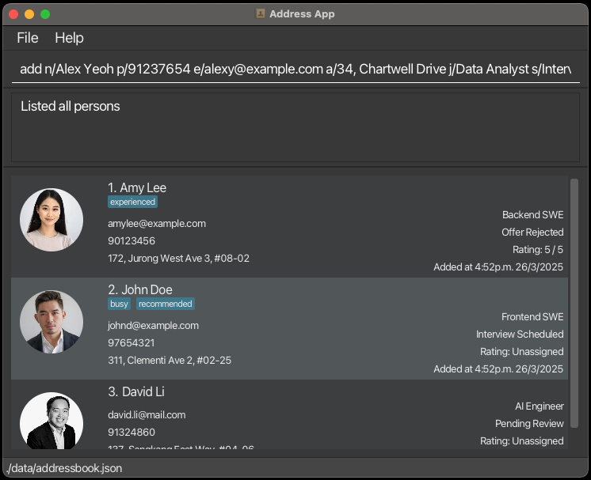<br/><br/>
Result:\
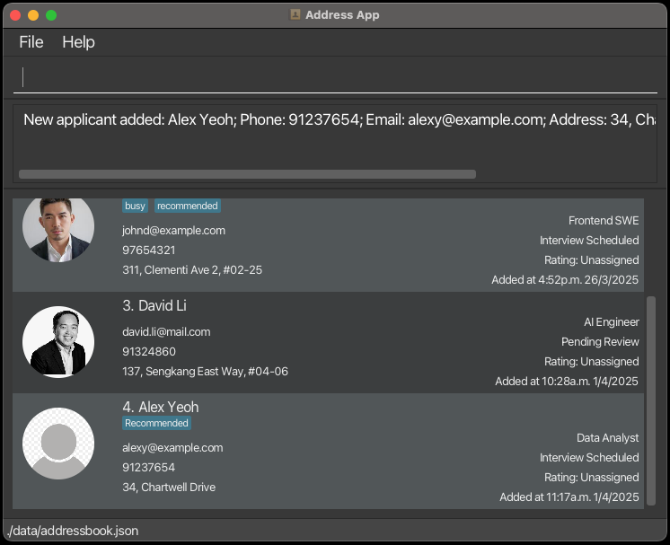<br/><br/>

### ✏️ Editing Details
**Command Format**: `edit INDEX [n/NAME] [p/PHONE] [e/EMAIL] [j/JOBPOSITION] [a/ADDRESS] [t/TAG]…`
* Edits the applicant at the specified `INDEX`. The index refers to the index number shown in the **displayed** applicant list. The index **must be a positive integer** 1, 2, 3, …​
* At least one of the optional fields must be provided.
* Updates must preserve uniqueness for applicant's phone number and email.
* Existing values will be updated to the input values.
* When editing tags, the existing tags of the applicant will be removed i.e. adding of tags is **not cumulative**.
* You can remove all the applicant’s tags by typing `t/` without
  specifying any tags after it.

**Example**:
```bash
edit 4 j/Data Scientist p/91238765
```
Updates phone number and job position for candidate #4.

Command Input:\
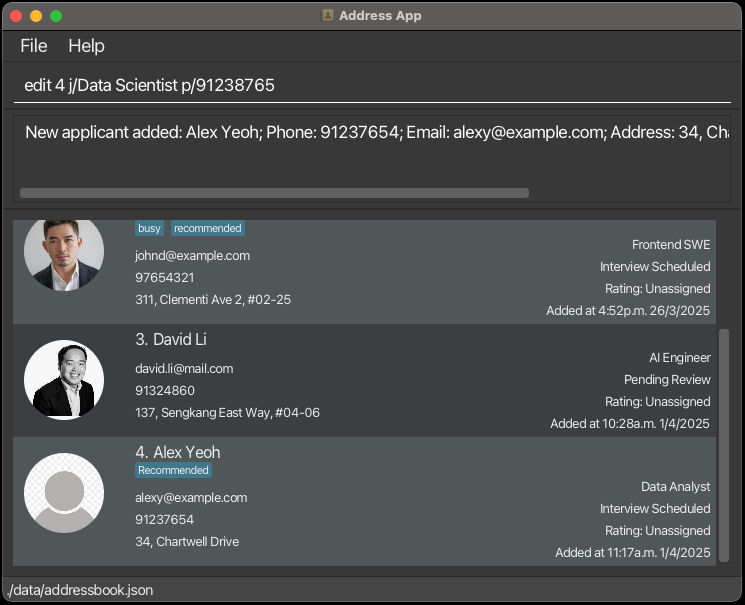<br/><br/>
Result:\
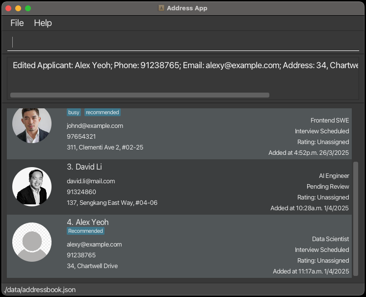<br/><br/>

### 🗑️ Removing Applicants
**Command Format**: `delete IDENTIFIER_TYPE/CONTACT_IDENTIFIER [--force]`
* Deletes the applicant based on the specified `IDENTIFIER_TYPE` and `CONTACT_IDENTIFIER`.
* The `IDENTIFIER_TYPE` can be either `id/` – the ID in the last shown list
  or any combination of the following:
    * `n/` – Name
    * `e/` – Email
    * `p/` – Phone number
    * `bfr/` - Date added (before the specified date)
    * `aft/` - Date added (after the specified date).
    * `j/` - Job Position
    * `s/` - Status
* The `CONTACT_IDENTIFIER` must match the corresponding identifier type (e.g., a name for `n/`, an email for `e/`, etc.).
* The `--force` flag (optional) bypasses confirmation prompts and deletes the applicant immediately.

**Example**:
```bash
delete n/Alex Yeoh --force
```
💡 **Pro Tip**: Adding `--force` skips confirmation for quick removal.

Command Input:\
<br/><br/>
Result:\
<br/><br/>

--------------------------------------------------------------------------------------------------------------------

## Tracking Progress

### 🔄 Updating Status
Move candidates through your pipeline:

**Command Format**: `update IDENTIFIER_TYPE/CONTACT_IDENTIFIER s/STATUS [--force]`
* Identifies the applicant based on the specified `IDENTIFIER_TYPE` and `CONTACT_IDENTIFIER`, then updates their application status to the provided `STATUS`.
* The `IDENTIFIER_TYPE` must include `s/` for status AND either `id/` – the ID in the last shown list
  or any combination of the following:
  * `n/` – Name
  * `e/` – Email
  * `p/` – Phone number
  * `bfr/` - Date added (before the specified date)
  * `aft/` - Date added (after the specified date).
  * `j/` - Job Position
* The `CONTACT_IDENTIFIER` must match the corresponding identifier type (e.g., a name for `n/`, an email for `e/`, etc.).
* The `--force` flag (optional) bypasses confirmation prompts and updates the applicant immediately.

**Common Statuses**:
1. `Applied` 🆕
2. `Screening` 🔍
3. `Interview Scheduled` 💬
4. `Offered` ✉️
5. `Failed` ❌
6. `Offer Accepted` 🎉
7. `Offer Rejected` ❎

**Example**:
```bash
update n/John Doe s/Job Offered --force
```
💡 **Pro Tip**: Adding `--force` skips confirmation for quick update.

Command Input:\
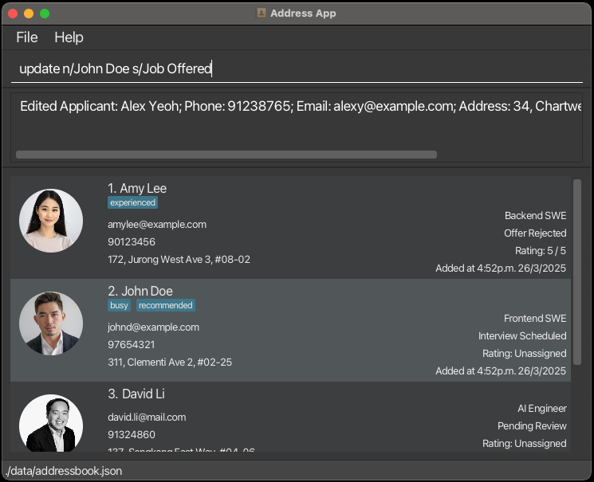<br/><br/>
Result:\
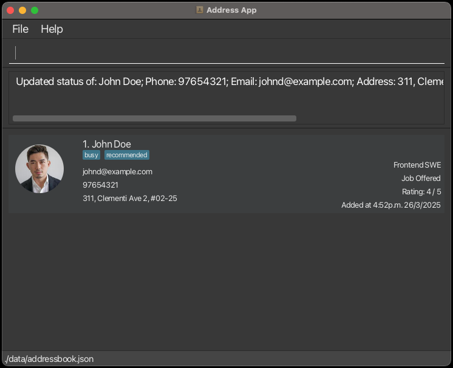<br/><br/>

### ⭐ Rating Candidates
Give 1-5 star ratings, or set it as unassigned if you're still unsure:

**Command Format**: `rate IDENTIFIER_TYPE/CONTACT_IDENTIFIER r/RATING`
* Identifies the applicant based on the specified `IDENTIFIER_TYPE` and `CONTACT_IDENTIFIER`, then assigns the provided `RATING` to them.
* The `IDENTIFIER_TYPE` can be one of the following:
    * `n/` – Name
    * `e/` – Email
    * `p/` – Phone number
    * `id/` – The index of the applicant in the last shown list
* The `CONTACT_IDENTIFIER` must match the corresponding identifier type (e.g., a name for `n/`, an email for `e/`, etc.).
* The `RATING` should be either:
    * an integer from **1 to 5**, decimal values are not accepted, or
    * `-1`, which will set the rating as `unassigned`.

**Example**:
```bash
rate id/2 r/4
```
Now candidate #2 has a shiny 4-star rating!

Command Input:\
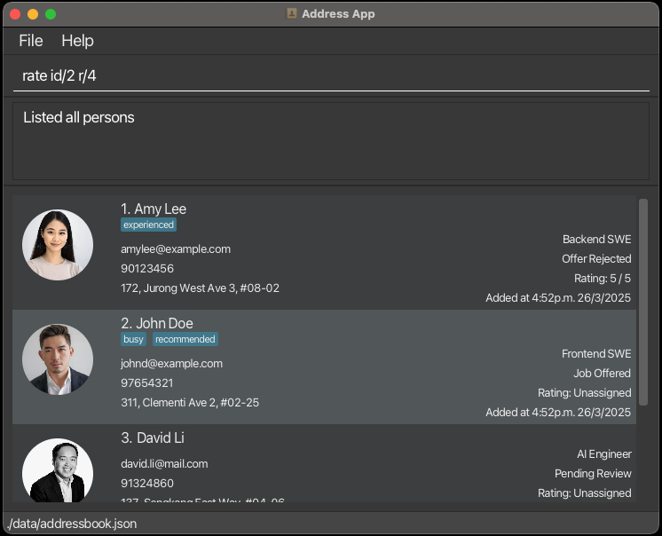<br/><br/>
Result:\
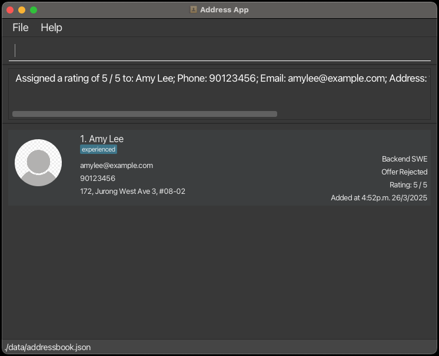<br/><br/>


[🔝 Back to top](#🌟-recruittrack-user-guide)

--------------------------------------------------------------------------------------------------------------------

## Finding Your Perfect Hire

### 📋 Listing Everyone
Simple command to see all candidates:
```bash
list
```

### 🔎 Smart Searching
Find candidates by any detail:

**Command Format**: `search [n/NAME] [e/EMAIL] [j/JOB] [s/STATUS] [p/PHONE] [bfr/BEFORE] [aft/AFTER]`
* The search is **case-insensitive**. e.g. `hans` will match `Hans`
* Only full words will be matched e.g. `Han` will not match `Hans`
* Only applicants that match any provided criteria are returned (i.e. logical `OR` search, applicant that match **any** specified field values will appear in the results).<br>
  e.g. `search n/John e/john@example.com` searches by name or email

**Example**:
```bash
search j/Frontend SWE
```
Shows all frontend developers.

Command Input:\
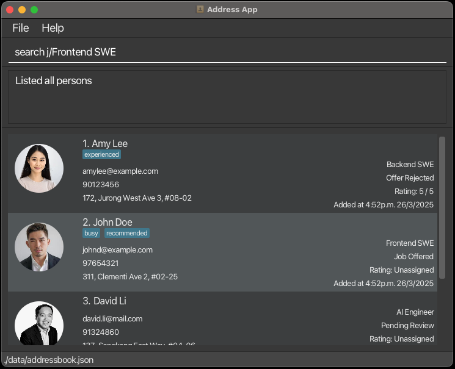<br/><br/>
Result:\
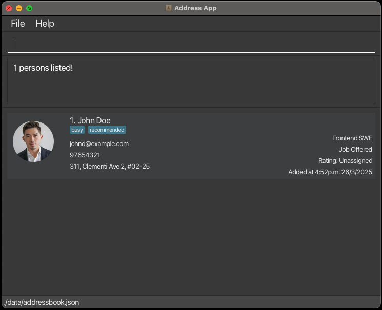<br/><br/>

### 🔄 Sorting Your View
Organize by what matters most:

**Command Format**: `sort CRITERIA/ ORDER/`
* Sort the applicant list by the sorting `CRITERIA/`. 
* The supported `CRITERIA/` are:
    * `n/`: Applicant's name
    * `e/`: Applicant's email address
    * `time/`: The time the applicant was added to the list.
    * `j/`: Job position
    * `s/`: Application status
* The `ORDER/` is optional, with the default being ascending:
    * `a/`: Ascending order
    * `d/`: Descending order
* Only one sorting criterion can be provided at a time.
* The list will be sorted in lexicographical order with case sensitivity based on the chosen criterion.

**Example**:
```bash
sort n/
```
Shows applicants in alphabetical order.

Command Input:\
<br/><br/>
Result:\
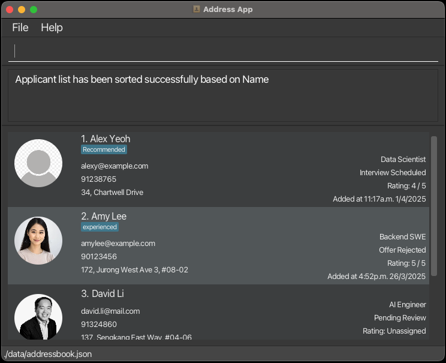<br/><br/>

--------------------------------------------------------------------------------------------------------------------

## Power User Tools

### 📤 Exporting Data
Export the **currently displayed** applicant data into a CSV (Comma-Separated Values) file for sharing:

**Command Format**: `export [FILE-NAME]`
* `FILE-NAME`: The name of the CSV file to be created. It can include a relative folder path (e.g., `data/export.csv`), but the folder must already exist.
* File extension `.csv` is recommended for proper formatting.

**Example**:
```bash
export candidates.csv
```
<br/>

### 📊 Summary Reports
Get quick statistics:

**Command Format**: `summary [n/NAME] [e/EMAIL] [j/JOB] [s/STATUS] [p/PHONE] [bfr/BEFORE] [aft/AFTER]`
* Having no identifiers will summarize all applicants
* The filter is case-insensitive. e.g. `hans` will match `Hans`
* Only full words will be matched e.g. `Han` will not match `Hans`
* Only applicants that match all provided identifiers are returned (i.e. `AND` search).<br>
  e.g. `summary s/Rejected j/Data Analyst` summarizes applicants applying for the role of Data Analyst with the status "Rejected".

**Example Output**:
```
Summarized 4 / 4 Applicants
Job Positions ->
[Data Scientist: 1, AI Engineer: 1, Frontend SWE: 1, Backend SWE: 1]
Statuses ->
[Interview Scheduled: 1, Pending Review: 2, Offer Rejected: 1]
```

[🔝 Back to top](#🌟-recruittrack-user-guide)

--------------------------------------------------------------------------------------------------------------------

## Miscellaneous

### Adding/Updating Profile Picture

* This is not a command.
* To change the profile picture, click on the existing picture.
* A pop-up window will appear, allowing you to select an image for the applicant.
  * Ensure the image size is below 2MB.
<br/><br/>

### Clear All Records

Clears all applicant data from the application.<br/>

❗️**Warning:** This is an **irreversible** action that removes **ALL** entries from the applicant records

**Command Format:** `clear`
<br/><br/>

### Exit the Application  

**Command Format:** `exit`

--------------------------------------------------------------------------------------------------------------------

## 💾 Your Data is Safe With Us

🔒 **Automatic Saving**: Every change is saved instantly  
📂 **Easy Backups**: Just copy the `data/` folder  
🔄 **Recovery**: Restore backups in a [single step](#how-do-i-import-my-data)

--------------------------------------------------------------------------------------------------------------------

## ❓ Frequently Asked Questions

### How do I import my data?
Just copy the `data/` folder into the folder containing `recruittrack.jar` - it's that easy!

### Can I undo a deletion?
Not directly, but if you have a backup of your data file, you can restore it by following the steps [above](#how-do-i-import-my-data).

### Can I change the colors?
Not yet, but we're working on theme options for a future update!

--------------------------------------------------------------------------------------------------------------------

## Cheat Sheet


| Action      | Format, Examples                                                                                                                                                                                                                      |
|-------------|---------------------------------------------------------------------------------------------------------------------------------------------------------------------------------------------------------------------------------------|
| **Help**    | `help`                                                                                                                                                                                                                                |
| **Add**     | `add n/NAME p/PHONE_NUMBER e/EMAIL j/JOB_POSITION s/STATUS a/ADDRESS [t/TAG]…​` <br> e.g., `add n/James Ho p/22224444 e/jamesho@example.com j/Frontend Engineer s/Online Assessment a/123, Clementi Rd, 1234665 t/friend t/SQLExpert` |
| **List**    | `list`                                                                                                                                                                                                                                |
| **Edit**    | `edit INDEX [n/NAME] [p/PHONE_NUMBER] [e/EMAIL] [a/ADDRESS] [t/TAG]…​`<br> e.g.,`edit 2 n/James Lee e/jameslee@example.com`                                                                                                           |
| **Export**  | `export [FILE-NAME]`<br> e.g., `export applicantData.csv`                                                                                                                                                                             |
| **Search**  | `search [n/NAME] [e/EMAIL] [j/JOB] [s/STATUS] [p/PHONE] [bfr/BEFORE] [aft/AFTER]`<br> e.g., `search n/James Jake`                                                                                                                     |
| **Delete**  | `delete IDENTIFIER_TYPE/CONTACT_IDENTIFIER [--force]`<br> e.g., `delete n/John Doe`<br> e.g., `delete id/3 --force`                                                                                                                   |
| **Update**  | `update IDENTIFIER_TYPE/CONTACT_IDENTIFIER s/STATUS [--force]` <br> e.g., `update e/johndoe@example.com s/Pending Review`                                                                                                             |
| **Sort**    | `sort CRITERIA/`<br> e.g., `sort n/`                                                                                                                                                                                                  |
| **Summary** | `summary [n/NAME] [e/EMAIL] [j/JOB] [s/STATUS] [p/PHONE] [bfr/BEFORE] [aft/AFTER]`<br> e.g., `summary j/Frontend Engineer`                                                                                                            |
| **Rate**    | `rate IDENTIFIER_TYPE/CONTACT_IDENTIFIER r/RATING`<br> e.g., `rate n/Amy Lee r/5`                                                                                                                                                     |
| **Clear**   | `clear`                                                                                                                                                                                                                               |
| **Exit**    | `exit`                                                                                                                                                                                                                                |

<br/>

--------------------------------------------------------------------------------------------------------------------

## Final Thoughts

We hope you enjoy using RecruitTrack as much as we enjoyed making it! Remember:

✨ Happy recruiting = Happy hiring! ✨

Need help? Just type `help` in the app or reach out to our friendly support team.

[🔝 Back to top](#🌟-recruittrack-user-guide)
