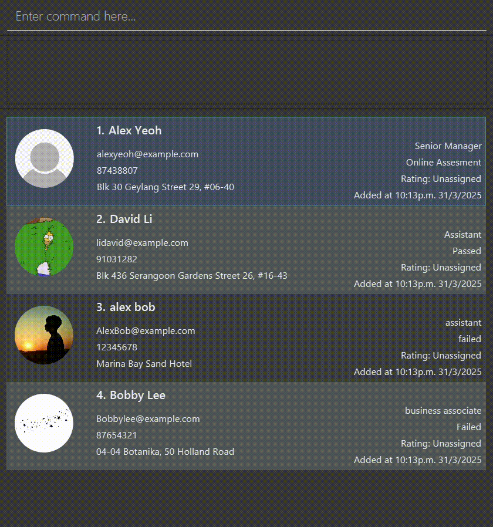

<!-- * Table of Contents -->
<page-nav-print />

# RecruitTrack User Guide

Welcome to **RecruitTrack**, your efficient companion for managing job applicants! RecruitTrack is a **desktop application designed for recruiters and hiring managers** who prefer a fast and streamlined workflow. It is optimized for users who can type quickly, leveraging a **Command Line Interface (CLI)** while still offering the benefits of a **Graphical User Interface (GUI)**.

With RecruitTrack, you can:
- Quickly add, edit, and remove applicants from your records
- Track candidate progress throughout the hiring process
- Search, filter, and sort applicants efficiently
- Manage candidate information without relying on a mouse

RecruitTrack is lightweight, runs on **Java 17 or later**, and works offline. Whether you're in HR, recruitment, or part of a hiring team, RecruitTrack simplifies applicant tracking so you can focus on finding top talent.

## Who is this guide for?
This guide helps:
- **First-time users** getting started
- **Recruiters and hiring managers** wanting efficiency
- **Power users** maximizing keyboard productivity

Let's explore how RecruitTrack can streamline your hiring process!

## Table of Contents

### Managing Applicants
- [Add](#adding-an-applicant-add)
- [Delete](#deleting-an-applicant-delete)
- [Edit](#editing-an-applicant-edit)
- [Profile Picture](#addingchanging-an-applicants-profile-picture)
- [Clear](#clearing-all-entries-clear)

### Tracking Applications
- [Update](#updating-the-application-status-of-an-applicant-update)
- [Rate](#assigning-a-rating-of-1-to-5-to-an-applicant-rate)

### Searching for Applicants
- [List](#listing-all-applicants-list)
- [Search](#searching-applicants-search)
- [Sort](#sorting-applicant-list-sort)

### Advanced Features
- [CSV Export](#exporting-applicant-data-export)
- [Summary](#summarising-applicants-summary)

### Others
- [Help](#viewing-help-help)
- [Exit](#exiting-the-program-exit)

--------------------------------------------------------------------------------------------------------------------
## 🚀 Getting Started in 5 Minutes

Let's get you up and running quickly!

### 1️⃣ Install Java
First, ensure you have **Java 17 or later**.  
*Mac users:* Our [special guide](https://se-education.org/guides/tutorials/javaInstallationMac.html) has you covered!

### 2️⃣ Download the App
Grab the latest version from our [download page](https://github.com/AY2425S2-CS2103T-W09-1/tp/releases).

### 3️⃣ Set Up Your Workspace
Place the `.jar` file in your favorite folder – this will be your RecruitTrack home.

### 4️⃣ Launch and Explore
Open a command terminal, cd into the folder you put the jar file in, and use the java -jar recruittrack.jar command to run the application.

```bash
java -jar recruittrack.jar
```
You'll see our friendly interface welcoming you:

Main Screen Tour // todo: add screenshot here

### 5️⃣ Try These Starter Commands
Type in the command box:

help 📚 - Shows all commands

add n/Emma p/87654321 e/emma@tech.com j/Developer ➕ - Adds Emma

list 📋 - Shows everyone

exit 🚪 - Leaves the party (saves automatically!)


## Quick start

1. Ensure you have Java 17 or above installed in your Computer.<br>
   **Mac users:** Ensure you have the precise JDK version prescribed [here](https://se-education.org/guides/tutorials/javaInstallationMac.html).

1. Download the latest .jar file from [here](https://github.com/AY2425S2-CS2103T-W09-1/tp/releases).

1. Copy the file to the folder you want to use as the _home folder_ for your RecruitTrack.

1. Open a command terminal, cd into the folder you put the jar file in, and use the java -jar recruittrack.jar command to run the application.<br>
   A GUI similar to the one below should appear in a few seconds. Note how the app contains some sample data.<br>
   

1. Type the command in the command box and press Enter to execute it. e.g. typing **help** and pressing Enter will open the help window.<br>
   Some example commands you can try:

    * list : Lists all applicants.

      * add n/John Doe p/98765432 e/johnd@example.com j/Front-end Engineer s/Online Assessment a/John street, block 123, #01-01 : Adds a applicant named John Doe to the Applicant Records.

    * delete id/3 : Deletes the 3rd applicant shown in the current list.

    * clear : Deletes all applicants.

    * exit : Exits the app.

1. Refer to the [Features](#features) below for details of each command.

--------------------------------------------------------------------------------------------------------------------

## Features

<box type="info" seamless>

**Notes about the command format:**<br>

* Words in UPPER_CASE are the parameters to be supplied by the user.<br>
  e.g. in add n/NAME, NAME is a parameter which can be used as add n/John Doe.

* Items in square brackets are optional.<br>
  e.g. n/NAME [t/TAG] can be used as n/John Doe t/friend or as n/John Doe.

* Items with …​ after them can be used multiple times including zero times.<br>
  e.g. [t/TAG]…​ can be used as   (i.e. 0 times), t/friend, t/friend t/family etc.

* Parameters can be in any order.<br>
  e.g. if the command specifies n/NAME p/PHONE_NUMBER, p/PHONE_NUMBER n/NAME is also acceptable.

* Extraneous parameters for commands that do not take in parameters (such as help, list, exit and clear) will be ignored.<br>
  e.g. if the command specifies help 123, it will be interpreted as help.

* If you are using a PDF version of this document, be careful when copying and pasting commands that span multiple lines as space characters surrounding line-breaks may be omitted when copied over to the application.
  </box>

### Viewing help: help

Shows a message explaining how to access the help page.


Format: help

--------------------------------------------------------------------------------------------------------------------

## Managing Applicants

### Adding an applicant: add

Adds an applicant to the applicant records.

Format: add n/NAME p/PHONE_NUMBER e/EMAIL j/JOB_POSITION s/STATUS a/ADDRESS [t/TAG]…​

<box type="tip" seamless>

**Tip:** A applicant can have any number of tags (including 0)
</box>

Examples:
* add n/John Doe p/98765432 e/johnd@example.com j/Frontend Engineer s/Online Assessment a/John street, block 123, #01-01
* add n/Betsy Crowe t/friend e/betsycrowe@example.com j/Backend Intern s/Offered a/Raffles Hall p/1234567 t/criminal

### Deleting an applicant: delete

Deletes the specified applicant from the applicant records, including all associated application details.

Format: delete IDENTIFIER_TYPE/CONTACT_IDENTIFIER [--force]

* Deletes the applicant based on the specified IDENTIFIER_TYPE and CONTACT_IDENTIFIER.
* The IDENTIFIER_TYPE can be either id/ - the ID in the last shown list
  or any combination of the following:
    * n/ - Name
    * e/ - Email
    * p/ - Phone number
    * bfr/ - Date added (before the specified date)
    * aft/ - Date added (after the specified date).
    * j/ - Job Position
    * s/ - Status
* The CONTACT_IDENTIFIER must match the corresponding identifier type (e.g., a name for n/, an email for e/, etc.).
* The --force flag (optional) bypasses confirmation prompts and deletes the applicant immediately.

Examples:
* delete n/John Doe e/johndoe@example.com deletes the applicant with the name "John Doe" and email "johndoe@example.com".
* delete id/3 --force deletes the 3rd applicant in the last shown list without confirmation.
* delete p/12345678 deletes the applicant with the phone number "12345678".
  
  

### Editing an applicant: edit

Edits an existing applicant in the Applicant Records.

Format: edit INDEX [n/NAME] [p/PHONE] [e/EMAIL] [a/ADDRESS] [t/TAG]…​

* Edits the applicant at the specified INDEX. The index refers to the index number shown in the displayed applicant list. The index must be a positive integer 1, 2, 3, …​
* At least one of the optional fields must be provided.
* Existing values will be updated to the input values.
* When editing tags, the existing tags of the applicant will be removed i.e. adding of tags is not cumulative.
* You can remove all the applicant's tags by typing t/ without
  specifying any tags after it.

Examples:
* edit 1 p/91234567 e/johndoe@example.com Edits the phone number and email address of the 1st applicant to be 91234567 and johndoe@example.com respectively.
* edit 2 n/Betsy Crower t/ Edits the name of the 2nd applicant to be Betsy Crower and clears all existing tags.

### Adding/Changing an Applicant's Profile Picture

Update the applicant's profile picture through the GUI.

#### Steps:
1. Click on the applicant's profile picture in the GUI.
2. A file selection window will pop up.
3. Choose an image file from your computer and confirm your selection.
4. The selected image will be set as the applicant's profile picture.

#### Notes:
* If no image is selected, no change will be made to the profile picture.
* The supported image formats are JPG, JPEG, PNG, GIF.
* The image will be automatically resized to fit the profile display.

#### Example:


### Clearing all entries: clear

Clears all entries from the applicant records.

Format: clear

--------------------------------------------------------------------------------------------------------------------

## Tracking Applications

### Updating the application status of an applicant: update

Updates the status of the specified applicant from the applicant records.

Format: update IDENTIFIER_TYPE/CONTACT_IDENTIFIER s/STATUS

* Identifies the applicant based on the specified IDENTIFIER_TYPE and CONTACT_IDENTIFIER, then updates their application status to the provided STATUS.
* The IDENTIFIER_TYPE can be one of the following:
    * n/ - Name
    * e/ - Email
    * p/ - Phone number
    * id/ - The index of the applicant in the last shown list
* The CONTACT_IDENTIFIER must match the corresponding identifier type (e.g., a name for n/, an email for e/, etc.).
* The STATUS should contain only alphanumeric characters and spaces.

Note: The date specified after /bfr and/or /aft must be in YYYY-MM-DD format.

Examples:
* update n/John Doe s/Interview Scheduled updates the status of the applicant with the name "John Doe" to "Interview Scheduled".
* update e/johndoe@example.com s/Pending Review updates the status of the applicant with the email "johndoe@example.com" to "Pending Review".
* update id/3 s/Offer Accepted updates the status of the 3rd applicant in the last shown list to "Offer Accepted".
* update p/12345678 s/Failed updates the status of the applicant with the phone number "+6512345678" to "Failed".
  
  

### Assigning a rating of 1 to 5 to an applicant: rate

Assign a rating of 1 to 5 to the specified applicant from the applicant records, possibly based on their suitability for the position.

Format: rate IDENTIFIER_TYPE/CONTACT_IDENTIFIER r/RATING

* Identifies the applicant based on the specified IDENTIFIER_TYPE and CONTACT_IDENTIFIER, then assigns the provided RATING to them.
* The IDENTIFIER_TYPE can be one of the following:
    * n/ - Name
    * e/ - Email
    * p/ - Phone number
    * id/ - The index of the applicant in the last shown list
* The CONTACT_IDENTIFIER must match the corresponding identifier type (e.g., a name for n/, an email for e/, etc.).
* The RATING should be an integer from 1 to 5, decimal values are not accepted.

Examples:
* rate n/Amy Lee r/5 assigns a rating of 5 / 5 to the applicant with the name "Amy Lee".
* rate e/alexy@example.com r/3 assigns a rating of 3 / 5 to the applicant with the email "alexy@example.com".
* rate id/3 r/2 assigns a rating of 2 / 5 to the 3rd applicant in the last shown list.
* rate n/Amy Lee r/5 assigns a rating of 1 / 5 to the applicant with the phone number "+6592345678".
  
  

--------------------------------------------------------------------------------------------------------------------

## Searching for Applicants

### Listing all applicants: list

Shows a list of all applicants in the applicant records.

Format: list

### Searching applicants: search

Searches applicants whose names contain any of the given keywords.

Format: search [n/NAME] [e/EMAIL] [j/JOB_POSITION] [s/STATUS]

Behavior :
* The search is case-insensitive. e.g. hans will match Hans
* Only full words will be matched e.g. Han will not match Hans
* Only applicants that match all provided criteria are returned (i.e. logical AND search, applicant must match all specified field values to appear in the results).<br>
  e.g. search n/John e/john@example.com searches by name and email

Examples:
- search e/john@example.com returns all applicants with that exact email (case-insensitive match).
- search j/Software Engineer s/Interviewing returns all applicants applying for "Software Engineer" and currently in the "Interviewing" stage.
- search n/Alice j/Product Manager s/Hired lists applicants named Alice who applied for Product Manager and are already hired.
- search p/98764321 returns applicants whose phone numbers are "98764321".

### Sorting applicant list: sort

Sort the applicant list based on the criteria.

Format: sort CRITERIA/

* Sort the applicant list by the sorting CRITERIA/. The supported CRITERIA/ are:
    * n/: Applicant's name
    * e/: Applicant's email address
    * time/: The time the applicant was added to the list.
    * j/: Job position
    * s/: Hiring stage
* Only one sorting criterion can be provided at a time.
* The list will be sorted in lexicographical order with case sensitivity based on the chosen criterion.

Examples:
* sort time/ sorts the list by the time the applicant was added.
* sort n/ sorts the list by name.
  
  

--------------------------------------------------------------------------------------------------------------------

## Advanced Features

### Exporting Applicant Data: export

Allows users to export the currently displayed applicant data into a CSV (Comma-Separated Values) file.

Format: export [FILE-NAME]

Parameters:
- FILE-NAME: The name of the CSV file to be created. It can include a relative folder path (e.g., data/export.csv), but the folder must already exist.
- File extension .csv is recommended for proper formatting.

The exported file will contain all applicants currently visible in the UI list. These applicants may be the result of any command that filters the list, such as list, search, or filter.

Each row in the CSV file represents a single applicant and includes the following fields:

| Field         | Description                        |
|---------------|------------------------------------|
| Name          | Full name of the applicant         |
| Email         | Email address                      |
| Phone         | Contact number                     |
| Job Position  | The job role applied for           |
| Status        | Current application status         |
| Tags          | Any tags associated with applicant |

Tags are exported as a single comma-separated string in the last column.

Examples:
* export applicants_data.csv  
  → Exports the currently displayed list of applicants into a file named applicants_data.csv in the working directory.

* export data/recruittrack_list.csv  
  → Exports to a file inside the data/ folder. The folder must already exist.

### Summarising applicants: summary
Summarize all the applicants' details. (Filtered by identifiers)

Format: summary [n/NAME] [e/EMAIL] [j/JOB_POSITION] [s/STATUS]

* Having no identifiers will summarize all applicants
* The filter is case-insensitive. e.g. hans will match Hans
* Only full words will be matched e.g. Han will not match Hans
* Only applicants that match all provided identifiers are returned (i.e. AND search).<br>
  e.g. summary s/Rejected a/Bishan summarizes applicants with the status "Rejected" and the address "Bishan".

Examples:
* summary summarizes all the applicants
* summary j/Software Engineer returns
  commandline
  Summarized 22 / 45 Applicants
  Job Positions ->
  [Software Engineer: 1]
  Statuses ->
  [Online Assessment: 5, Round 1: 7, Resume Screening: 3, Rejected: 3, Accepted: 2, Final interview: 2]

--------------------------------------------------------------------------------------------------------------------

## Others

### Exiting the program: exit

Exits the program.

Format: exit

### Saving the data

RecruitTrack data are saved in the hard disk automatically after any command that changes the data. There is no need to save manually.

### Editing the data file

RecruitTrack data are saved automatically as a JSON file [JAR file location]/data/addressbook.json. Advanced users are welcome to update data directly by editing that data file.

<box type="warning" seamless>

**Caution:**
If your changes to the data file makes its format invalid, RecruitTrack will discard all data and start with an empty data file at the next run. Hence, it is recommended to take a backup of the file before editing it.<br>
Furthermore, certain edits can cause the RecruitTrack to behave in unexpected ways (e.g., if a value entered is outside the acceptable range). Therefore, edit the data file only if you are confident that you can update it correctly.
</box>

### Archiving data files [coming in v2.0]

_Details coming soon ..._

--------------------------------------------------------------------------------------------------------------------

## FAQ

**Q**: How do I transfer my data to another Computer?<br>
**A**: Install the app in the other computer and overwrite the empty data file it creates with the file that contains the data of your previous RecruitTrack home folder.

--------------------------------------------------------------------------------------------------------------------

## Known issues

1. **When using multiple screens**, if you move the application to a secondary screen, and later switch to using only the primary screen, the GUI will open off-screen. The remedy is to delete the preferences.json file created by the application before running the application again.
2. **If you minimize the Help Window** and then run the help command (or use the Help menu, or the keyboard shortcut F1) again, the original Help Window will remain minimized, and no new Help Window will appear. The remedy is to manually restore the minimized Help Window.

--------------------------------------------------------------------------------------------------------------------

## Command summary

| Action      | Format, Examples                                                                                                                                                                                                                    |
|-------------|-------------------------------------------------------------------------------------------------------------------------------------------------------------------------------------------------------------------------------------|
| **Help**    | help                                                                                                                                                                                                                                |
| **Add**     | add n/NAME p/PHONE_NUMBER e/EMAIL j/JOB_POSITION s/STATUS a/ADDRESS [t/TAG]…​ <br> e.g., add n/James Ho p/22224444 e/jamesho@example.com j/Frontend Engineer s/Online Assessment a/123, Clementi Rd, 1234665 t/friend t/SQLExpert |
| **List**    | list                                                                                                                                                                                                                                |
| **Edit**    | edit INDEX [n/NAME] [p/PHONE_NUMBER] [e/EMAIL] [a/ADDRESS] [t/TAG]…​<br> e.g.,edit 2 n/James Lee e/jameslee@example.com                                                                                                           |
| **Export**  | export [FILE-NAME]<br> e.g., export applicantData.csv                                                                                                                                                                             |
| **Search**  | search [n/NAME] [e/EMAIL] [j/JOB_POSITION] [s/STATUS]<br> e.g., search n/James Jake                                                                                                                                               |
| **Delete**  | delete IDENTIFIER_TYPE/CONTACT_IDENTIFIER [--force]<br> e.g., delete n/John Doe<br> e.g., delete id/3 --force                                                                                                                   |
| **Update**  | update IDENTIFIER_TYPE/CONTACT_IDENTIFIER s/STATUS <br> e.g., update e/johndoe@example.com s/Pending Review                                                                                                                       |
| **Sort**    | sort CRITERIA/<br> e.g., sort n/                                                                                                                                                                                                  |
| **Summary** | summary [n/NAME] [e/EMAIL] [j/JOB_POSITION] [s/STATUS]<br> e.g., summary j/Frontend Engineer                                                                                                                                      |
| **Rate**    | update IDENTIFIER_TYPE/CONTACT_IDENTIFIER r/RATING<br> e.g., rate n/Amy Lee r/5                                                                                                                                                   |
| **Clear**   | clear                                                                                                                                                                                                                               |
| **Exit**    | exit             


---
layout: default.md
title: "User Guide"
pageNav: 3
---

# 🌟 RecruitTrack User Guide

Welcome to **RecruitTrack** – your cheerful companion for stress-free hiring! ✨ Designed for recruiters who love efficiency, our app combines the speed of **keyboard commands** with the comfort of a **visual interface**.


## 🎯 Why You'll Love RecruitTrack

- 🚀 **Blazing fast** applicant management
- � **No more mouse dependency** – everything at your fingertips
- 🌈 **Colorful interface** that's easy on the eyes
- 📊 **Smart organization** to keep your pipeline flowing
- 💾 **Automatic saves** so you never lose data

[🔝 Back to top](#)

--------------------------------------------------------------------------------------------------------------------

## 🚀 Getting Started in 5 Minutes

Let's get you up and running quickly!

### 1️⃣ Install Java
First, ensure you have **Java 17 or later**.  
*Mac users:* Our [special guide](https://se-education.org/guides/tutorials/javaInstallationMac.html) has you covered!

### 2️⃣ Download the App
Grab the latest version from our [download page](https://github.com/AY2425S2-CS2103T-W09-1/tp/releases).

### 3️⃣ Set Up Your Workspace
Place the `.jar` file in your favorite folder – this will be your RecruitTrack home.

### 4️⃣ Launch and Explore
Double-click the file or run:
```bash
java -jar recruittrack.jar
```

You'll see our friendly interface welcoming you:


### 5️⃣ Try These Starter Commands
Type in the command box:
- `help` 📚 - Shows all commands
- `add n/Emma p/87654321 e/emma@tech.com j/Developer` ➕ - Adds Emma
- `list` 📋 - Shows everyone
- `exit` 🚪 - Leaves the party (saves automatically!)

[🔝 Back to top](#)

--------------------------------------------------------------------------------------------------------------------

## ✨ Feature Highlights

### 👥 People Management
- `add` - Welcome new candidates
- `edit` - Update details
- `delete` - Remove applicants

### 🔍 Finding Talent
- `search` - Find needles in haystacks
- `sort` - Organize your view
- `list` - See everyone at once

### 📈 Tracking Progress
- `update` - Move candidates through stages
- `rate` - Give star ratings
- `summary` - Get the big picture

### 🛠️ Advanced Tools
- `export` - Take data elsewhere
- Profile pics - Add friendly faces

[🔝 Back to top](#)

--------------------------------------------------------------------------------------------------------------------

## 🧑‍💻 Working With Applicants

### ➕ Adding New Candidates
**Command**:  
`add n/NAME p/PHONE e/EMAIL j/JOB s/STATUS [t/TAG]...`

**Example**:
```bash
add n/Lucas p/91234567 e/lucas@design.com j/UX Designer s/Interview t/Creative t/Portfolio
```


💡 **Pro Tip**: Tags help you categorize candidates for easy searching later!

### ✏️ Editing Details
**Command**:  
`edit INDEX [n/NAME] [p/PHONE]...`

**Example**:
```bash
edit 2 p/98765432 s/Technical\ Interview
```
Updates phone number and status for candidate #2.

### 🗑️ Removing Applicants
**Command**:  
`delete id/INDEX [--force]`

**Example**:
```bash
delete id/3 --force
```
Skips confirmation for quick removal.


[🔝 Back to top](#)

--------------------------------------------------------------------------------------------------------------------

## 📊 Tracking Progress

### 🔄 Updating Status
Move candidates through your pipeline:

**Command**:  
`update id/INDEX s/STATUS`

**Common Stages**:
1. `Applied` 🆕
2. `Screening` 🔍
3. `Interview` 💬
4. `Offered` ✉️
5. `Hired` 🎉

**Example**:
```bash
update id/5 s/Interview
```

### ⭐ Rating Candidates
Give 1-5 star ratings:

**Command**:  
`rate id/INDEX r/RATING`

**Example**:
```bash
rate id/2 r/4
```
Now candidate #2 has a shiny 4-star rating!


[🔝 Back to top](#)

--------------------------------------------------------------------------------------------------------------------

## 🔍 Finding Your Perfect Hire

### 📋 Listing Everyone
Simple command to see all candidates:
```bash
list
```

### 🔎 Smart Searching
Find candidates by any detail:

**Command**:  
`search [n/NAME] [e/EMAIL] [j/JOB] [s/STATUS]`

**Example**:
```bash
search j/Developer s/Interview
```
Shows all developers currently in interviews.

### 🔄 Sorting Your View
Organize by what matters most:

**Command**:  
`sort CRITERIA/`

**Options**:
- `n/` - Name
- `time/` - When added
- `s/` - Current status

**Example**:
```bash
sort time/
```
Shows newest applicants first.

[🔝 Back to top](#)

--------------------------------------------------------------------------------------------------------------------

## 🛠️ Power User Tools

### 📤 Exporting Data
Create CSV files for sharing:

**Command**:  
`export FILENAME.csv`

**Example**:
```bash
export april_candidates.csv
```

### 📊 Summary Reports
Get quick statistics:

**Command**:  
`summary [j/JOB] [s/STATUS]`

**Example Output**:
```
🌟 Candidate Summary 🌟
Total: 42 applicants
Top Jobs:
- Developer: 18
- Designer: 9
Current Status:
- Screening: 12
- Interview: 8
```

[🔝 Back to top](#)

--------------------------------------------------------------------------------------------------------------------

## 💾 Your Data is Safe With Us

🔒 **Automatic Saving**: Every change is saved instantly  
📂 **Easy Backups**: Just copy the `data/` folder  
🔄 **Recovery**: Previous versions are kept for safety

<box type="warning" seamless>
⚠️ **Important**: While you can edit the data file directly, we recommend using the app interface to avoid accidents!
</box>

[🔝 Back to top](#)

--------------------------------------------------------------------------------------------------------------------

## ❓ Frequently Asked Questions

### 🧐 How do I move my data to a new computer?
Just copy the `data/addressbook.json` file to the new computer - it's that easy!

### 😅 Can I undo a deletion?
Not directly, but if you have a backup of your data file, you can restore it.

### 🌈 Can I change the colors?
Not yet, but we're working on theme options for a future update!

[🔝 Back to top](#)

--------------------------------------------------------------------------------------------------------------------

## 🎨 Cheat Sheet

| Action | Command | Example |
|--------|---------|---------|
| Add | `add n/NAME p/PHONE e/EMAIL j/JOB` | `add n/Alex p/91234567 e/alex@ex.com j/Developer` |
| Edit | `edit INDEX [FIELD/VALUE]` | `edit 1 p/98765432` |
| Delete | `delete id/INDEX` | `delete id/3` |
| Update | `update id/INDEX s/STATUS` | `update id/2 s/Interview` |
| Rate | `rate id/INDEX r/1-5` | `rate id/4 r/5` |
| Export | `export FILENAME.csv` | `export candidates.csv` |

[🔝 Back to top](#)

--------------------------------------------------------------------------------------------------------------------

## 💌 Final Thoughts

We hope you enjoy using RecruitTrack as much as we enjoyed making it! Remember:

✨ Happy recruiting = Happy hiring! ✨

Need help? Just type `help` in the app or reach out to our friendly support team.

[🔝 Back to top](#)